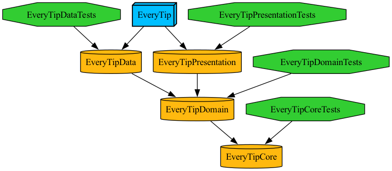

# EveryTip

## Tuist

### Tuist 설치
```
$ curl -Ls https://install.tuist.io | bash
```

이하의 작업들은 Project.swift 파일이 위치한 프로젝트 폴더에서 터미널로 진행합니다.

### Tuist 의존성 설치
```swift
$ tuist fetch
```

### Tuist 프로젝트 생성
```swift
// tuist generate {타겟명}
// tuist generate 또한 가능
```


#### 앱 의존성 그래프


앱 타겟이 Data, Presentation, Domain, Core Layer에 의존하고 있음.

#### Tuist 의존성 그래프 legend


<br>

## 참고
- [git 작업 컨벤션](GIT_CONVENTION.md)
- [코딩 컨벤션](CODING_CONVENTION.md)
