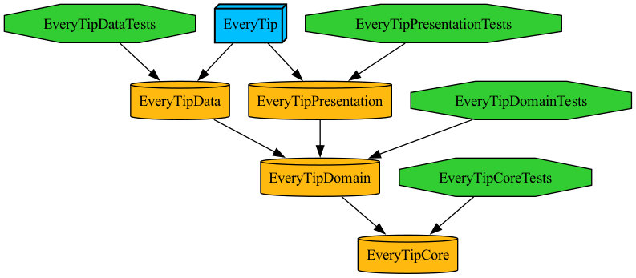

# EveryTip

> 누구나 자신만의 꿀팁을 공유하고 발견하는 iOS 소셜 팁 공유 플랫폼

<br>

<!-- 스크린샷: 앱 메인 화면 캡처 (홈,/ 탐색, 프로필 탭) -->
<table width="100%">
  <tr>
    <td align="center" width="25%">
      
    </td>
    <td align="center" width="25%">
      
    </td>
    <td align="center" width="25%">
      
    </td>
    <td align="center" width="25%">
      
    </td>
  </tr>
</table>

### 🔗 Link
[](https://apps.apple.com/kr/app/%EC%97%90%EB%B8%8C%EB%A6%AC-%ED%8C%81-%EC%84%B8%EC%83%81%EC%9D%98-%EB%AA%A8%EB%93%A0-%ED%8C%81%EC%9D%84-%ED%95%9C-%EA%B3%B3%EC%97%90/id6749445749) 
> ⚠️ 현재는 서비스가 종료되었습니다.


<br>

## 목차

- [프로젝트 소개](#프로젝트-소개)
- [주요 기능](#주요-기능)
- [기술 스택](#기술-스택)
- [아키텍처](#아키텍처)
- [모듈 구조](#모듈-구조)
- [네트워크 레이어](#네트워크-레이어)
- [의존성 주입](#의존성-주입)
- [설치 및 실행](#설치-및-실행)

<br>

## 프로젝트 소개

**EveryTip**은 사용자들이 카테고리별 꿀팁을 작성, 공유, 저장할 수 있는 iOS 소셜 플랫폼입니다.

- **플랫폼:** iOS 15.0+
- **빌드 도구:** Tuist 4.30.0
- **협업 및 품질 관리:** 
   - Cross-functional Product Team: **iOS(1)**, BE(1), FE(1), Designer(2)가 기획 초기 단계부터 긴밀히 협업하여 유저 시나리오 설계 및 서비스 상세 스펙 확정
   - High-Quality Code Standards: 1인 개발 환경임에도 현직 시니어 iOS 엔지니어와 전수 코드 리뷰(Pull Request) 프로세스를 운영하여 실무 수준의 코드 퀄리티 및 아키텍처 검증 완료


클린 아키텍처와 반응형 프로그래밍 패턴을 중심으로, 실무 수준의 모듈화 구조와 유지보수성 높은 코드베이스 구성을 목표로 개발했습니다.

<br>

## 주요 기능

### 인증

- 이메일 기반 회원가입 / 로그인
- 이메일 인증 코드 발송 및 검증
- 비밀번호 찾기 / 재설정
- JWT 기반 자동 토큰 갱신 (keyChain 기반)

### 홈 / 탐색

- 사용자 상태 기반의 동적 온보딩 시스템 구축 (로그인 여부 및 관심 카테고리 설정 여부)
- 카테고리별 팁 피드
- 인기순 정렬: `(좋아요 × 10 + 조회수)` 가중 점수 기반 알고리즘
- 키워드 검색 및 검색 기록 관리 (UserDefaults 기반)

### 팁 관리
          
- 팁 작성 / 수정 / 삭제 (이미지 포함)
- 좋아요 / 저장 / 공유
- 댓글 작성 및 조회
- Presigned URL을 통한 이미지 업로드 (S3 호환)

### 소셜 기능

- 유저 팔로우 / 언팔로우
- 팔로워 / 팔로잉 목록
- 유저 차단 및 차단 목록 관리
- 프로필 수정 (닉네임, 카테고리, 비밀번호)

<br>

## 기술 스택

| 분류 | 기술 |
|:---|:---|
| 언어 | Swift 5 |
| UI | UIKit (Code-based) |
| 반응형 프로그래밍 | RxSwift 6, RxCocoa, RxDataSources |
| 상태 관리 | ReactorKit 3 |
| 레이아웃 | SnapKit 5 |
| 네트워크 | Alamofire 5 |
| 이미지 | Kingfisher 8 |
| 의존성 주입 | Swinject 2 |
| 빌드 / 모듈화 | Tuist 4.30.0 |
| 보안 | keychain (JWT 토큰 저장) |

<br>

## 아키텍처

### Clean Architecture + MVVM-C + ReactorKit

```
┌─────────────────────────────────────────────────────────┐
│                   Presentation Layer                    │
│                                                         │
│   ViewController ───bind──▶  Reactor  ───▶ UseCase(P)   │
│         ▲                      │           (Domain)     │
│         │                Action│State                   │
│         │                      ▼                        │
│    Coordinator  ◀──────  (Navigation Signal)            │
│   (Screen Flow)                                         │
└────────────────────────────┬────────────────────────────┘
                             │
┌────────────────────────────▼────────────────────────────┐
│                      Domain Layer                       │
│                                                         │
│   UseCase(P) ◀────── UseCase ──────▶ Repository(P)      │
│   (Business Logic)                 (Data Interface)     │
└────────────────────────────┬────────────────────────────┘
                             │
┌────────────────────────────▼────────────────────────────┐
│                       Data Layer                        │
│                                                         │
│   RepositoryImpl ──▶ APIService ──▶ DTO/Mappers         │
│   (Implementation)   (Network)                          │
└─────────────────────────────────────────────────────────┘
```

### ReactorKit 단방향 데이터 흐름

ReactorKit의 단방향 데이터 흐름(Unidirectional Data Flow)으로 Presentation 레이어의 상태를 관리합니다.

```
사용자 인터랙션
      │
      ▼
  [Action]          예: viewDidLoad, itemSelected, refreshPulled
      │
      ▼
  [mutate()]        비동기 UseCase 호출 (RxSwift Observable)
      │
      ▼
  [Mutation]        예: setTips([Tip]), setLoading(Bool)
      │
      ▼
  [reduce()]        순수 함수 — 이전 State + Mutation → 새 State
      │
      ▼
  [State]           ViewController가 bind()로 구독
      │
      ▼
  UI 업데이트       RxCocoa Driver / Signal 기반
```

**`Pulse` 오퍼레이터**
- ReactorKit의 `State`가 가진 중복 방지 특성을 보완하기 위해 `Pulse` 프로퍼티 래퍼를 도입했습니다. 이를 통해 동일한 메시지의 토스트 출력이나 중복 내비게이션 요청 등, 상태 값의 변화와 관계없이 **할당(Assign) 시점에 즉각 반응해야 하는 Side Effect**를 누락 없이 처리했습니다.

### Coordinator 패턴

화면 전환 로직을 ViewController에서 완전히 분리해 단일 책임 원칙(SRP)을 지킵니다.

```swift
protocol Coordinator: AnyObject {
    var childCoordinators: [Coordinator] { get set }
    func start()
...
}
```

- 부모-자식 Coordinator 관계로 메모리 관리
- 각 Feature별 Coordinator가 해당 화면의 네비게이션을 독립적으로 담당
- ViewController는 화면 전환 방식을 전혀 알지 못함

<br>

## 모듈 구조

Tuist를 사용해 기능 / 역할별로 프레임워크를 분리했습니다.
각 모듈은 명확한 의존성 방향을 가지며, 상위 레이어가 하위 레이어의 추상(Protocol)에만 의존하도록 설계해 결합도를 최소화했습니다.

```
EveryTip (App)
│
├── EveryTipPresentation    # UI, ViewController, Reactor, Coordinator
│   └── depends on: Domain, DesignSystem, Core
│
├── EveryTipDomain          # UseCase, Repository Protocol, Entity
│   └── depends on: (없음 — 순수 비즈니스 로직)
│
├── EveryTipData            # Repository 구현체, API, DTO, Network
│   └── depends on: Domain, Core
│
├── EveryTipDesignSystem    # Color, Font, UIComponent, Extension
│   └── depends on: (없음 — 독립적 UI 리소스)
│
└── EveryTipCore            # keychain, 공통 유틸리티
    └── depends on: (없음)
```

### 의존성 방향

```
Presentation
     │
     ├──▶ Domain ◀──── Data
     │
     ├──▶ DesignSystem
     │
     └──▶ Core ◀──────── Data
```

> 도메인 레이어는 어떤 외부 프레임워크에도 의존하지 않아 독립적으로 테스트할 수 있습니다.

### Tuist 의존성 그래프



<br>

## 네트워크 레이어

### TargetType 프로토콜 기반 API 추상화

모든 API 엔드포인트를 타입으로 정의해 타입 안전성을 확보했습니다.

```swift
protocol TargetType {
    var baseURL: String { get }
    var path: String { get }
    var method: HTTPMethod { get }
    var parameters: RequestParams { get }
    var headers: HTTPHeaders? { get }
}
```

각 API 도메인은 독립적인 Target enum으로 구현되어 있어, 엔드포인트 추가 시 해당 파일만 수정하면 됩니다.

### 자동 토큰 갱신 (TokenInterceptor)

Alamofire의 `RequestInterceptor`를 구현해 모든 요청에 Access Token을 자동으로 첨부하고, 401 응답 시 Refresh Token으로 재발급을 처리합니다.

```
요청 전  ──▶  adapt()   : Authorization 헤더에 Access Token 삽입
401 응답 ──▶  retry()   : Refresh Token으로 새 Access Token 발급
                          → keychain 갱신 후 원래 요청 재시도
```

토큰은 keychain에 안전하게 저장되며, 앱 재시작 후에도 로그인 상태가 유지됩니다.

### API 구성

| Target | 담당 영역 |
|:---|:---|
| `AuthTarget` | 로그인, 회원가입, 이메일 인증, 토큰 갱신, 비밀번호 재설정 |
| `TipTarget` | 팁 CRUD, 좋아요, 저장, 이미지 업로드(Presigned URL) |
| `UserTarget` | 프로필, 팔로우/언팔로우, 카테고리, 닉네임 검증, 유저 차단 |
| `CommentTarget` | 댓글 CRUD |

<br>

## 의존성 주입

**Swinject**의 Assembly 패턴으로 레이어별 의존성을 등록하고 `Container.shared`로 앱 전체에서 주입합니다.

```
AppDelegate
    │
    ├── DataAssembly          # Repository 구현체 등록
    ├── DomainAssembly        # UseCase 등록
    └── PresentationAssembly  # Coordinator, Factory 등록
```

UseCase는 Repository의 구체 타입이 아닌 **Protocol에만 의존**하므로, 테스트 시 Mock 객체로 쉽게 교체할 수 있습니다.

```swift
// DomainAssembly 예시
container.register(TipUseCaseProtocol.self) { r in
    TipUseCase(
        tipRepository: r.resolve(TipRepositoryProtocol.self)!
    )
}
```

<br>

## 설치 및 실행

### 요구 사항

- Xcode 15.0+
- [mise](https://mise.jdx.dev) 또는 [Tuist](https://tuist.io) 설치

### 프로젝트 생성

```bash
# 저장소 클론
git clone https://github.com/KimRoks/Every_Tip.git
cd Every_Tip/EveryTip

# mise를 통한 Tuist 버전 설정
mise use tuist@4.30.0

# 패키지 의존성 설치
tuist install

# Xcode 프로젝트 생성
tuist generate

# 워크스페이스 열기
open EveryTip.xcworkspace
```

> **참고:** API Base URL은 `xcconfig` 파일을 통해 환경별로 관리됩니다.

<br>

## 프로젝트 구조

```
EveryTip/
├── Targets/
│   ├── EveryTip/                      # App Target (AppDelegate)
│   ├── EveryTipPresentation/
│   │   └── Sources/
│   │       ├── Home/                  # HomeViewController, HomeReactor, HomeCoordinator
│   │       ├── Auth/                  # Login, Signup, ForgotPassword
│   │       ├── Tip/                   # TipDetail, PostTip, PhotoPicker
│   │       ├── User/                  # UserProfile, UserFollow, BlockedList
│   │       ├── Search/                # Search, SearchHistory
│   │       └── Common/                # BaseViewController, Coordinator Protocol
│   ├── EveryTipDomain/
│   │   └── Sources/
│   │       ├── Entities/              # Tip, User, Comment (Domain Model)
│   │       ├── UseCases/              # TipUseCase, AuthUseCase, UserUseCase
│   │       └── Repositories/          # Repository Protocols
│   ├── EveryTipData/
│   │   └── Sources/
│   │       ├── Services/
│   │       │   ├── APIs/              # AuthTarget, TipTarget, UserTarget, CommentTarget
│   │       │   ├── Network/           # TargetType, TokenInterceptor, NetworkError
│   │       │   └── DTO/               # Response DTOs
│   │       └── Repositories/          # Repository 구현체
│   ├── EveryTipDesignSystem/
│   │   └── Sources/
│   │       ├── Extension/             # UIColor+, UIFont+, UIImage+, UIView+
│   │       └── Resources/             # Pretendard 폰트
│   └── EveryTipCore/
│       └── Sources/
│           └── KeyChain/              # TokenKeyChainManager
└── Tuist/
    ├── Package.swift                  # SPM 의존성 선언
    └── Config.swift                   # Tuist 설정
```

<br>

## 참고

- [Git 작업 컨벤션](GIT_CONVENTION.md)
- [코딩 컨벤션](CODING_CONVENTION.md)

<br>

---

> 클린 아키텍처 기반의 모듈화, ReactorKit을 활용한 단방향 상태 관리, Coordinator 패턴을 통한 네비게이션 분리 등
> 실무에서 요구되는 iOS 개발 패턴을 직접 설계하고 적용하는 것을 목표로 개발한 프로젝트입니다.
